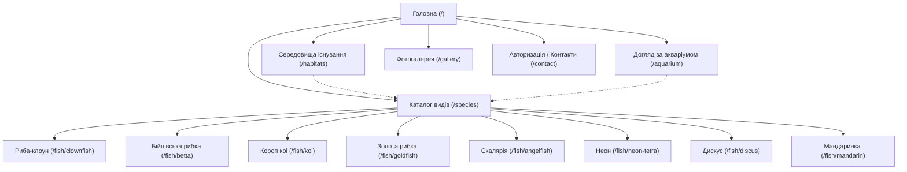

# Семантичне ядро проєкту AquaFauna

**AquaFauna** — україномовна онлайн-енциклопедія світу риб, природних біотопів та відповідальної акваріумістики.

---

## 1. Загальна архітектура та структура URL

---

## 2. Кластеризація пошукових запитів

### Кластер 1. Загальний / Брендовий (Головна сторінка — `/`)
| Тип запиту | Ключова фраза | Інтент | Пріоритет |
| :--- | :--- | :--- | :--- |
| **ВЧ** | енциклопедія риб | Інформаційний | Високий |
| **ВЧ** | акваріумні рибки | Інформаційний | Високий |
| **ВЧ** | світ риб | Інформаційний | Середній |
| **СЧ** | довідник акваріумних риб | Інформаційний | Високий |
| **СЧ** | акваріумістика для початківців | Навчальний | Високий |
| **НЧ** | енциклопедія риб українською мовою | Інформаційний | Високий |
| **Бренд** | aquafauna, аквафауна | Навігаційний | Високий |

---

### Кластер 2. Каталог та класифікація риб (`/species`)
| Тип запиту | Ключова фраза | Інтент | Пріоритет |
| :--- | :--- | :--- | :--- |
| **ВЧ** | види риб | Інформаційний | Високий |
| **ВЧ** | види акваріумних рибок | Інформаційний | Високий |
| **СЧ** | прісноводні риби каталог | Інформаційний | Високий |
| **СЧ** | морські акваріумні рибки | Інформаційний | Високий |
| **СЧ** | риби для маленького акваріума | Комерційний/Інфо | Високий |
| **СЧ** | мирні акваріумні риби | Інформаційний | Середній |
| **НЧ** | невибагливі акваріумні рибки для початківців | Інформаційний | Високий |
| **НЧ** | класифікація риб за середовищем існування | Дослідницький | Середній |

---

### Кластер 3. Конкретні види риб (`/fish/:slug`)

#### 3.1. Риба-клоун (`/fish/clownfish`)
* **ВЧ:** риба клоун, amphiprion ocellaris
* **СЧ:** риба клоун утримання, морський акваріум риба клоун, клоун і актинія симбіоз
* **НЧ:** параметри води для риби клоуна, чим годувати рибу клоуна в акваріумі

#### 3.2. Бійцівська рибка / Півник (`/fish/betta`)
* **ВЧ:** бійцівська рибка, рибка півник, betta splendens
* **СЧ:** півник рибка догляд, чи потрібен фільтр для півника, утримання півника в акваріумі
* **НЧ:** температура води для півника, сумісність рибки півник з іншими рибами

#### 3.3. Короп коі (`/fish/koi`)
* **ВЧ:** короп коі, парчевий короп, cyprinus rubrofuscus
* **СЧ:** коі для ставка, скільки живуть коі, годування коі в ставку
* **НЧ:** зимівля коропів коі в ставку, мінімальний об'єм водойми для коі

#### 3.4. Золота рибка (`/fish/goldfish`)
* **ВЧ:** золота рибка, carassius auratus
* **СЧ:** золота рибка догляд, об'єм акваріума для золотої рибки, вуалехвіст
* **НЧ:** скільки живе золота рибка, чому не можна тримати золоту рибку в круглій вазі

#### 3.5. Скалярія (`/fish/angelfish`)
* **ВЧ:** скалярія, pterophyllum scalare
* **СЧ:** скалярії догляд та розмноження, амазонські скалярії, сумісність скалярій
* **НЧ:** висота акваріума для скалярій, з якими рибами уживаються скалярії

#### 3.6. Неон звичайний (`/fish/neon-tetra`)
* **ВЧ:** неон звичайний, рибки неони, paracheirodon innesi
* **СЧ:** скільки неонів тримати в зграї, неони в травнику, параметри води для неонів
* **НЧ:** сумісність блакитного неона з креветками, м'яка вода для неонів

#### 3.7. Дискус (`/fish/discus`)
* **ВЧ:** дискус, король акваріума, symphysodon
* **СЧ:** дискуси утримання, температура води для дискусів, годування дискусів
* **НЧ:** вимоги до фільтрації для дискусів, хвороби та імунітет дискуса

#### 3.8. Мандаринка (`/fish/mandarin`)
* **ВЧ:** мандаринка риба, synchiropus splendidus
* **СЧ:** рибка мандаринка морський акваріум, годування мандаринки живим каменем
* **НЧ:** чи підходить мандаринка для нано-рифу, психоделічна риба рифу

---

### Кластер 4. Біотопи та середовища існування (`/habitats`)
| Ключова фраза | Інтент | Посадковий блок |
| :--- | :--- | :--- |
| кораловий риф екосистема | Інформаційний | `#coral-reef` |
| біотоп річки амазонки чорна вода | Інформаційний | `#amazon` |
| декоративний ставок біотоп | Інформаційний | `#pond` |
| тропічні водойми південно-східної азії | Інформаційний | `#asia-fresh` |
| пелагічна зона відкритого океану | Науково-популярний | `#open-ocean` |

---

### Кластер 5. Догляд та гідрохімія (`/aquarium`)
| Ключова фраза | Частотність | Тематичний блок |
| :--- | :--- | :--- |
| азотний цикл в акваріумі | ВЧ | Біофільтрація |
| запуск акваріума з нуля | ВЧ | Покроковий гід |
| аміак нітрити нітрати в акваріумі | СЧ | Тестування води |
| як правильно міняти воду в акваріумі | СЧ | Обслуговування |
| скільки годин світити в акваріумі | СЧ | Освітлення та водорості |
| як часто годувати риб | СЧ | Годування |

---

### Кластер 6. Галерея та фото (`/gallery`)
* **ВЧ:** фото акваріумних риб, гарні риби фото
* **СЧ:** фото коралових рифів, акваскейп фото, шпалери риби 4k

---

## 3. LSI-лексика (Latent Semantic Indexing)

Для підвищення релевантності сторінок у пошукових системах використовуються наступні семантично пов'язані терміни:

* **Гідрохімія:** `pH (кислотність)`, `dGH (загальна твердість)`, `kH (карбонатна твердість)`, `солоність (ppt)`, `аміак (NH3/NH4+)`, `нітрити (NO2-)`, `нітрати (NO3-)`, `таніни`, `гумінові кислоти`.
* **Обладнання та біологія:** `біофільтр`, `аерація`, `компресор`, `живий камінь`, `актинія`, `симбіоз`, `лабіринтовий орган`, `зграйна поведінка`, `селекційна форма`, `азотний цикл`, `акваскейп`.

---

## 4. Шаблони генерації Meta-тегів

### 1. Головна сторінка (`/`)
* **Title:** `AquaFauna — Енциклопедія світу риб | Від рифу до ставка`
* **Description:** `Енциклопедія глибин: понад 8 популярних видів риб, 5 біотопів, інтерактивний паралакс, таблиця параметрів води та науково обґрунтовані поради.`
* **H1:** `Світ риб — від рифу до ставка`

### 2. Каталог (`/species`)
* **Title:** `Каталог видів риб — Фото, опис та параметри води | AquaFauna`
* **Description:** `Повний каталог риб: морські, прісноводні, ставкові види. Фільтрація за середовищем існування, параметри води (pH, температура), складність утримання.`
* **H1:** `Види риб`

### 3. Картка виду (`/fish/:slug`)
* **Title:** `{name_uk} ({name_lat}) — Догляд, параметри води, опис | AquaFauna`
* **Description:** `{name_uk} ({name_lat}): родина {family}, середовище {habitat_name}. Розмір {size_cm} см, температура {temperature}, pH {ph}. {summary}`
* **H1:** `{name_uk}`
* **H2:** `Опис`, `Факти`, `Параметри`, `З того ж біотопу`

### 4. Біотопи (`/habitats`)
* **Title:** `Середовища існування та природні біотопи риб | AquaFauna`
* **Description:** `Огляд природних біотопів: коралові рифи, чорні води Амазонки, тропічні мілководдя Азії, ставки та відкритий океан. Параметри солоності, світла та температури.`
* **H1:** `Середовища існування`

### 5. Догляд (`/aquarium`)
* **Title:** `Догляд за акваріумом — Азотний цикл, запуск та годування | AquaFauna`
* **Description:** `Практичний гід з акваріумістики: біологічний азотний цикл (аміак, нітрити, нітрати), правила запуску акваріума, вибір об'єму, годування та освітлення.`
* **H1:** `Догляд за акваріумом`

---

## 5. Мікророзмітка Schema.org

1. **`WebSite` & `Organization`** — глобально у `head.html`
2. **`ItemList`** — у каталозі `/species` для швидкої індексації переліку риб пошуковими ботами
3. **`Article`** — на індивідуальних сторінках видів `/fish/:slug`
4. **`FAQPage`** — на сторінці догляду `/aquarium` для показу розширених сніпетів (Rich Snippets) у Google

---

## 6. Технічна оптимізація індексації

* **`robots.txt`**: Відкриває доступ для всіх пошукових ботів (`Allow: /`), дозволяє ресурси (`/images/`, `/css/`, `/js/`), забороняє службові API (`Disallow: /api/`) та вказує шлях до `sitemap.xml`.
* **`sitemap.xml`**: Динамічно формує актуальний перелік усіх сторінок та карток риб із зазначенням `priority` та `changefreq`.
